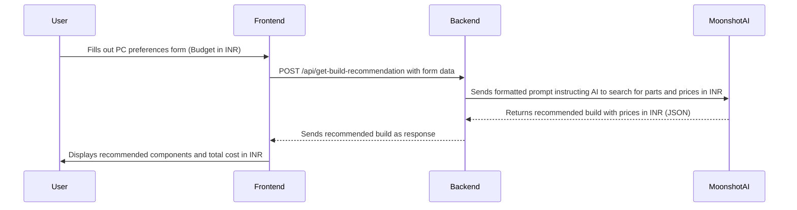

# AI-Powered PC Builder Web App

This document outlines the plan for creating a web application that helps users build custom PC configurations using AI recommendations.

## 1. Project Overview

The application will consist of a frontend where users can input their preferences and a backend that communicates with the Moonshot Kimi AI to generate PC build recommendations.

### Tech Stack
- **Frontend:** HTML, CSS, Vanilla JavaScript
- **Backend:** Node.js, Express.js
- **AI Service:** OpenRouter API (with DeepSeek model)

## 2. Application Flow

The following diagram illustrates the user journey and system interactions:



## 3. File Structure

```
/pc-builder-app
  /frontend
    - index.html       # Main form for user input
    - results.html     # Page to display recommendations
    - style.css        # CSS for styling
    - script.js        # Frontend logic for form handling and API calls
  /backend
    - server.js        # Express server setup and API routes
    - ai-service.js    # Module for Moonshot Kimi AI integration
  - package.json
  - README.md
```

## 4. AI Prompt Structure

When calling the Moonshot Kimi AI, the backend will construct a prompt similar to this:

> "You are an expert PC builder. A user wants to build a custom PC.
> **Budget:** ₹[budget] INR
> **Primary Use:** [pc_type]
> **Style Preference:** [style]
> **Form Factor:** [form_factor]
>
> Please recommend a complete set of compatible PC components (CPU, GPU, Motherboard, RAM, Storage, Power Supply, Case) that fits within the budget.
>
> **Instructions:**
> 1.  Search the internet for the latest components and their prices in **Indian Rupees (INR)** from popular Indian online retailers.
> 2.  Ensure all components are compatible with each other (e.g., CPU socket and motherboard).
> 3.  The total cost should not exceed the user's budget.
> 4.  For each component, provide the name, estimated price in INR, key specs, and a brief reason for your choice.
> 5.  Return the response as a JSON object."

## 5. Backend API

### Endpoint: `POST /api/get-build-recommendation`

- **Request Body:**
  ```json
  {
    "budget": 100000,
    "pc_type": "Gaming",
    "style": "Gaming RGB",
    "form_factor": "Desktop"
  }
  ```
- **Success Response (200 OK):**
  ```json
  {
    "total_cost": 98500,
    "parts": [
      { "type": "CPU", "name": "AMD Ryzen 5 5600X", "price": 15000, "specs": "6-core, 12-thread", "reason": "Excellent price-to-performance for gaming." },
      { "type": "GPU", "name": "NVIDIA GeForce RTX 3060 Ti", "price": 40000, "specs": "8GB GDDR6", "reason": "Great for 1080p/1440p gaming." }
    ]
  }
  ```
- **Error Response (500 Internal Server Error):**
  ```json
  {
    "error": "Failed to get recommendations from AI service."
  }
  ```

## 6. Development Plan

Here is the step-by-step plan for implementation:

- [ ] **1. Setup Project Structure:** Create the directories and empty files.
- [ ] **2. Create `package.json`:** Define dependencies (`express`, `axios`).
- [ ] **3. Develop Backend (`server.js`):**
    - Set up Express server.
    - Create the `/api/get-build-recommendation` endpoint.
- [ ] **4. Implement AI Service (`ai-service.js`):**
    - Create a function to construct the detailed prompt for the Moonshot Kimi AI, instructing it to search for parts and prices in INR.
    - Implement the API call logic.
- [ ] **5. Build Frontend Form (`index.html`, `style.css`):**
    - Create the user input form with budget in INR.
    - Add basic styling for a clean layout.
- [ ] **6. Implement Frontend Logic (`script.js`):**
    - Handle form submission.
    - Call the backend API.
    - Store results and redirect to `results.html`.
- [ ] **7. Build Results Page (`results.html`):**
    - Display the recommended parts and total cost in INR.
- [ ] **8. Add Features:**
    - Implement form validation.
    - Add loading spinners and error messages.
- [ ] **9. Testing:**
    - Test the full end-to-end flow with various inputs.

## 7. Running the Application

To run the application, follow these steps:

1.  **Navigate to the project directory:**
    Open your terminal and change the directory to where you've saved the project.
    ```bash
    cd path/to/pc-builder-app
    ```

2.  **Install dependencies:**
    If you haven't already, install the necessary Node.js packages.
    ```bash
    npm install
    ```

3.  **Configure Environment Variables:**
    Open the `pc-builder-app/.env` file and set the following variables:
    - `OPENROUTER_API_KEY`: Your API key from OpenRouter.
    - `HTTP_REFERER`: The URL of your application (e.g., `http://localhost:3000`). This is recommended by OpenRouter.

4.  **Start the server:**
    ```bash
    npm start
    ```
    The server will start on `http://localhost:3000`. If you see an `EADDRINUSE` error, it means the port is already being used by another application (likely a previous instance of this server).

5.  **Open the application:**
    Open your web browser and navigate to `http://localhost:3000`.

6.  **Stopping the server:**
    To stop the server, go to the terminal window where it is running and press `Ctrl + C`.