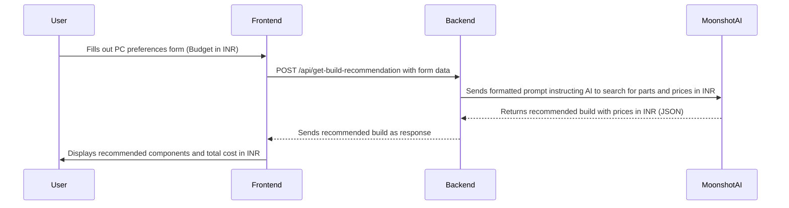

# AI-Powered PC Builder Web App

This document outlines the plan for creating a web application that helps users build custom PC configurations using AI recommendations.

## 1. Project Overview

The application will consist of a frontend where users can input their preferences and a backend that communicates with the Moonshot Kimi AI to generate PC build recommendations.

### Tech Stack
- **Frontend:** HTML, CSS, Vanilla JavaScript
- **Backend:** Node.js, Express.js
- **AI Service:** OpenAI API (GPT-4o)

## 2. Application Flow

The following diagram illustrates the user journey and system interactions:



## 3. File Structure

```
/pc-builder-app
  /frontend
    - index.html       # Main form for user input
    - results.html     # Page to display recommendations
    - style.css        # CSS for styling
    - script.js        # Frontend logic for form handling and API calls
  /backend
    - server.js        # Express server setup and API routes
    - ai-service.js    # Module for Moonshot Kimi AI integration
  - package.json
  - README.md
```

## 4. AI Prompt Structure

When calling the Moonshot Kimi AI, the backend will construct a prompt similar to this:

> "You are an expert PC builder. A user wants to build a custom PC.
> **Budget:** ₹[budget] INR
> **Primary Use:** [pc_type]
> **Style Preference:** [style]
> **Form Factor:** [form_factor]
>
> Please recommend a complete set of compatible PC components (CPU, GPU, Motherboard, RAM, Storage, Power Supply, Case) that fits within the budget.
>
> **Instructions:**
> 1.  Search the internet for the latest components and their prices in **Indian Rupees (INR)** from popular Indian online retailers.
> 2.  Ensure all components are compatible with each other (e.g., CPU socket and motherboard).
> 3.  The total cost should not exceed the user's budget.
> 4.  For each component, provide the name, estimated price in INR, key specs, and a brief reason for your choice.
> 5.  Return the response as a JSON object."

## 5. Backend API

### Endpoint: `POST /api/get-build-recommendation`

- **Request Body:**
  ```json
  {
    "budget": 100000,
    "pc_type": "Gaming",
    "style": "Gaming RGB",
    "form_factor": "Desktop"
  }
  ```
- **Success Response (200 OK):**
  ```json
  {
    "total_cost": 98500,
    "parts": [
      { "type": "CPU", "name": "AMD Ryzen 5 5600X", "price": 15000, "specs": "6-core, 12-thread", "reason": "Excellent price-to-performance for gaming." },
      { "type": "GPU", "name": "NVIDIA GeForce RTX 3060 Ti", "price": 40000, "specs": "8GB GDDR6", "reason": "Great for 1080p/1440p gaming." }
    ]
  }
  ```
- **Error Response (500 Internal Server Error):**
  ```json
  {
    "error": "Failed to get recommendations from AI service."
  }
  ```

## 6. Development Plan

Here is the step-by-step plan for implementation:

- [ ] **1. Setup Project Structure:** Create the directories and empty files.
- [ ] **2. Create `package.json`:** Define dependencies (`express`, `axios`).
- [ ] **3. Develop Backend (`server.js`):**
    - Set up Express server.
    - Create the `/api/get-build-recommendation` endpoint.
- [ ] **4. Implement AI Service (`ai-service.js`):**
    - Create a function to construct the detailed prompt for the Moonshot Kimi AI, instructing it to search for parts and prices in INR.
    - Implement the API call logic.
- [ ] **5. Build Frontend Form (`index.html`, `style.css`):**
    - Create the user input form with budget in INR.
    - Add basic styling for a clean layout.
- [ ] **6. Implement Frontend Logic (`script.js`):**
    - Handle form submission.
    - Call the backend API.
    - Store results and redirect to `results.html`.
- [ ] **7. Build Results Page (`results.html`):**
    - Display the recommended parts and total cost in INR.
- [ ] **8. Add Features:**
    - Implement form validation.
    - Add loading spinners and error messages.
- [ ] **9. Testing:**
    - Test the full end-to-end flow with various inputs.

## 7. Running the Application Locally (Vercel Development)

To run the application locally using the Vercel CLI (recommended for Vercel deployments):

1.  **Install Vercel CLI (if you haven't already):**
    ```bash
    npm install -g vercel
    ```

2.  **Navigate to your project directory:**
    ```bash
    cd path/to/pc-builder-app
    ```

3.  **Log in to Vercel (if not already logged in):**
    ```bash
    vercel login
    ```
    Follow the prompts to log in via your web browser.

4.  **Link your project to V Vercel (if not already linked):**
    If this is your first time running `vercel dev` for this project, you'll be asked to link it to a Vercel project.
    ```bash
    vercel link
    ```
    Follow the prompts to link to your existing Vercel project.

5.  **Pull Environment Variables Locally:**
    Ensure your `OPENAI_API_KEY` is set in your Vercel project's environment variables (in the Vercel dashboard). Then, pull them locally:
    ```bash
    vercel env pull .env.local
    ```
    This creates a `.env.local` file with your Vercel environment variables.

6.  **Run the application locally:**
    ```bash
    vercel dev
    ```
    The application will start on a local development server (usually `http://localhost:3000`).

7.  **Troubleshooting `EADDRINUSE` (Address already in use) Error:**
    If you encounter an `EADDRINUSE` error, it means another process is already using port `3000`. This often happens if you have multiple instances of `vercel dev` running or a previous instance didn't shut down cleanly.

    *   **Ensure only ONE `vercel dev` instance is running:**
        *   Check all open terminals (including your editor's integrated terminals).
        *   Terminate any running `vercel dev` processes (usually by pressing `Ctrl + C` within that terminal).
    *   **Find and Kill the Process (Windows - More Aggressive):**
        1.  Open Command Prompt as **Administrator**.
        2.  Run the following command to find the `node.exe` process using port 3000:
            ```bash
            for /f "tokens=5" %a in ('netstat -ano ^| findstr :3000') do @tasklist /fi "PID eq %a" | findstr /i "node.exe"
            ```
            This command will output the `Image Name` (e.g., `node.exe`) and its `PID`.
        3.  Note the `PID` of the `node.exe` process.
        4.  Run: `taskkill /PID YOUR_PID_HERE /F` (Replace `YOUR_PID_HERE` with the actual PID).
        5.  If you still see `TIME_WAIT`, `FIN_WAIT_2`, or `CLOSE_WAIT` states after this, these are transient states that will clear themselves in a minute or two. Wait a moment and try `vercel dev` again.
    *   **Find and Kill the Process (macOS/Linux):**
        1.  Open Terminal.
        2.  Run: `lsof -i :3000`
        3.  Note the `PID` from the output.
        4.  Run: `kill -9 YOUR_PID_HERE` (Replace `YOUR_PID_HERE` with the actual PID).
    *   After clearing the port (either by killing a `LISTENING` process or waiting for transient states to clear), try `vercel dev` again.

## 8. Running the Application Locally (Node.js Direct)

You can still run the application directly with Node.js for basic backend testing, but it won't fully simulate the Vercel environment.

1.  **Navigate to the project directory:**
    ```bash
    cd path/to/pc-builder-app
    ```

2.  **Install dependencies:**
    ```bash
    npm install
    ```

3.  **Configure Environment Variables:**
    Create a `.env` file in the project root and set:
    - `OPENAI_API_KEY=YOUR_OPENAI_API_KEY`

4.  **Start the server:**
    ```bash
    npm start
    ```
    The server will start on `http://localhost:3000`.

5.  **Open the application:**
    Open your web browser and navigate to `http://localhost:3000`.

6.  **Stopping the server:**
    To stop the server, go to the terminal window where it is running and press `Ctrl + C`.